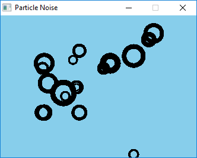

# CC136.2: Polar Noise Loop

    

This is a port to Go of [this](https://github.com/CodingTrain/website/tree/master/CodingChallenges/CC_136_Polar_Noise_Loop_2/Processing/CC_136_Polar_Noise_Loop_2) sketch written in Processing by Daniel Shiffman for their [Perlin Noise Gif Loops](https://thecodingtrain.com/CodingChallenges/136.2-perlin-noise-gif-loops.html) videos.

I had some trouble porting Dans implementation due to not really knowing the math and initially getting degrees anád radians mixed up.